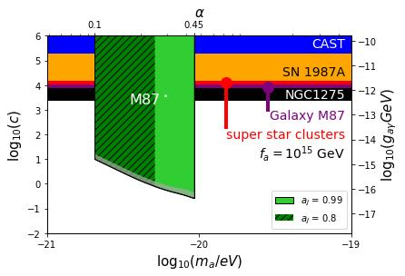

# Stringent axion constraints with Event Horizon Telescope polarimetric measurements of M87*

This github repository contains the data and code needed to reproduce the main results of the paper:

[Stringent axion constraints with Event Horizon Telescope polarimetric measurements of M87*]https://www.nature.com/articles/s41550-022-01620-3
[arXiv:2105.04572](https://arxiv.org/abs/2105.04572)

This code is written in python, which also requires numpy, matplotlib, scipy package and jupyter notebook. 

# Results Example

# Citation
@article{chen2022stringent,
  title={Stringent axion constraints with Event Horizon Telescope polarimetric measurements of M87⋆},
  author={Chen, Yifan and Liu, Yuxin and Lu, Ru-Sen and Mizuno, Yosuke and Shu, Jing and Xue, Xiao and Yuan, Qiang and Zhao, Yue},
  journal={Nature Astronomy},
  pages={1--7},
  year={2022},
  publisher={Nature Publishing Group}
}
